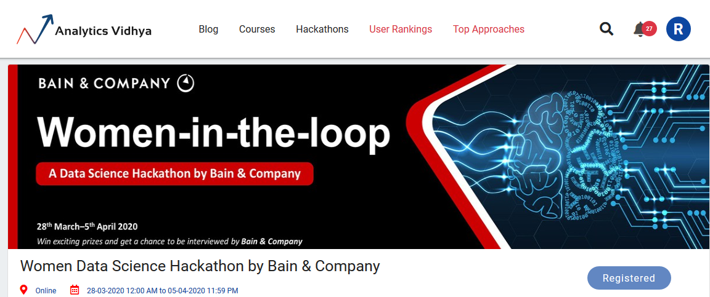
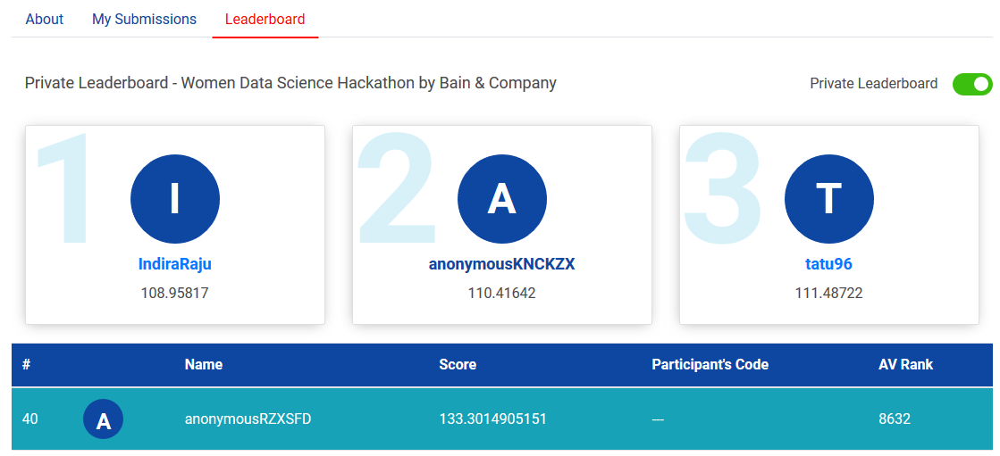
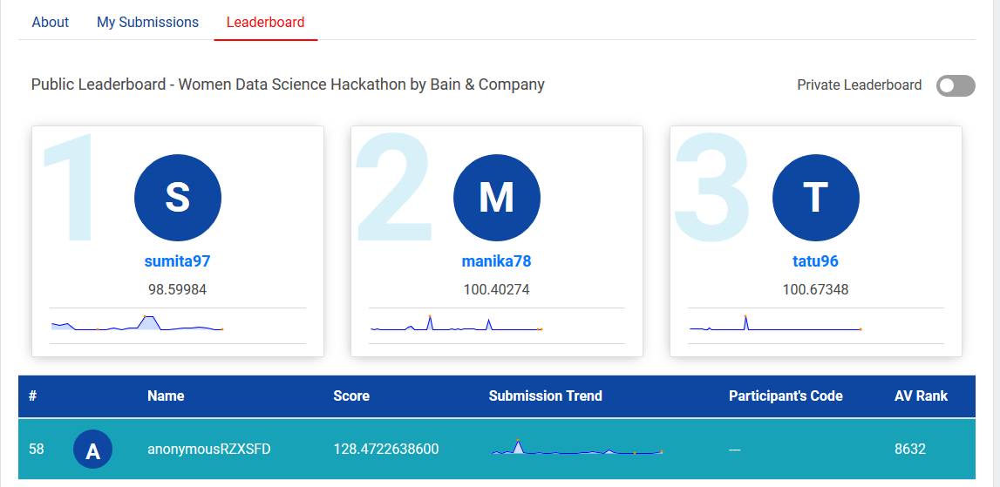

# AnalyticsVidya-Women-Data-Science-Hackathon-by-Bain-Company

## About Hackathon
We call upon all you amazing women data scientists to participate in our all-women, virtual hackathon for a chance to win prizes and/or be fast-tracked on to our recruiting process for the Bengaluru Data Science hub. We know that diversity leads to high-performing, innovative teams and we at Bain strive to get the best and brightest for our clients. And this means you! 

## Rank
### Private rank : 

### Public rank : 

## About Bain & Company
Bain & Company is one of the world's leading strategy consulting firms, where bold thinking, inspired people and a passion for results come together for extraordinary impact. This is where aspiration meets innovation, candor fuels collaboration and impossible surrenders to teamwork. We champion the bold to achieve the extraordinary. We’re a global consultancy that helps the world’s most ambitious change makers define the future. Across 58 offices in 37 countries, we work alongside our clients as one team with a shared ambition to achieve extraordinary results, outperform the competition and redefine industries. We complement our tailored, integrated expertise with a vibrant ecosystem of digital innovators to deliver better, faster and more enduring outcomes. Learn more about Bain at https://www.bain.com/

## Prizes:
    1st Prize, Flipkart voucher of INR 75,000
    2nd Prize, Flipkart voucher of INR 50,000
    3rd Prize, Flipkart voucher of INR 25,000
    Interview Opportunities with Bain & Company

## Eligibility for hiring:

    Preferably 3 years of working experience in data science, advanced analytics or machine learning.
    Bachelor’s or master’s degree in a quantitative discipline such as applied mathematics, computer science, statistics or related field.
    Eligible and open to working in Bangalore, India.
